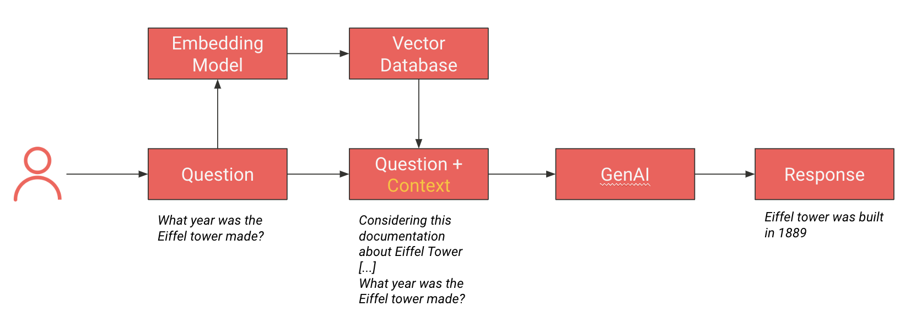

# RAG Lyon Data Science

Simple RAG (Retrieval Augmented Generation) using Vertex AI Generative AI (PaLM 2 model) and Qdrant Vector Database, 
presented at [Lyon Data Science meetup](https://www.meetup.com/fr-FR/lyon-data-science/events/296659531/)

## Installation 
- The project was developed and tested using Python 3.10
```shell
python3.10 -m venv ./venv
source ./venv/bin/activate
pip install -r requirements.txt
```
- Start a local Qdrant instance
```shell
docker pull qdrant/qdrant
docker run -p 6333:6333 -p 6334:6334 qdrant/qdrant
```
- [You need to have access to Vertex AI generative API through a GCP account](https://cloud.google.com/vertex-ai/docs/generative-ai/learn/overview)

## Usage
This repository contains 2 scripts:
- `rag_indexing.py` that index the content of `data/knowledge_base.json` (list of questions / responses) in a Qdrant vector database.
  - Questions are embedded using Vertex AI Generative model (gecko).
  - Qdrant URL can be configured in `constant.py` (default localhost)
  - You can define the port to use (HTTP and GRPC) when creating the Qdrant client (default are 6333 for HTTP, 6334 for GRPC)
`data/knowledge_base.json`.
- `rag_inference.py` that performs the following steps:
  1. Ask a question to the user
  2. Embed the question using the same model as during indexing
  3. Retrieve the nearest (semantic) questions in the database
  4. Build a context for the user question, using the responses to the questions retrieved at the previous step
  5. Build a prompt and ask a LLM (here PaLM 2) for the response

Note that the scripts can be easily adapted to use another Vector DB / LLM (GPT for example)

Overall process:
